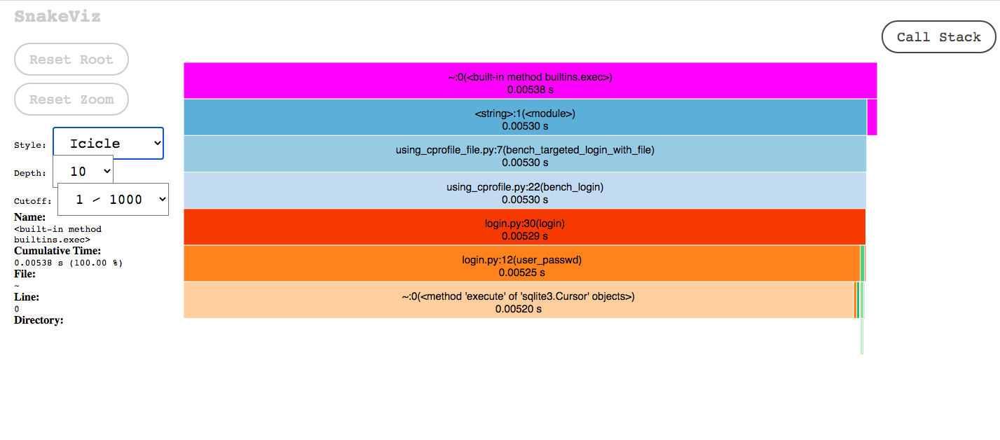
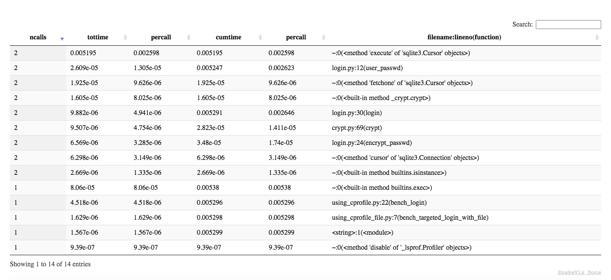
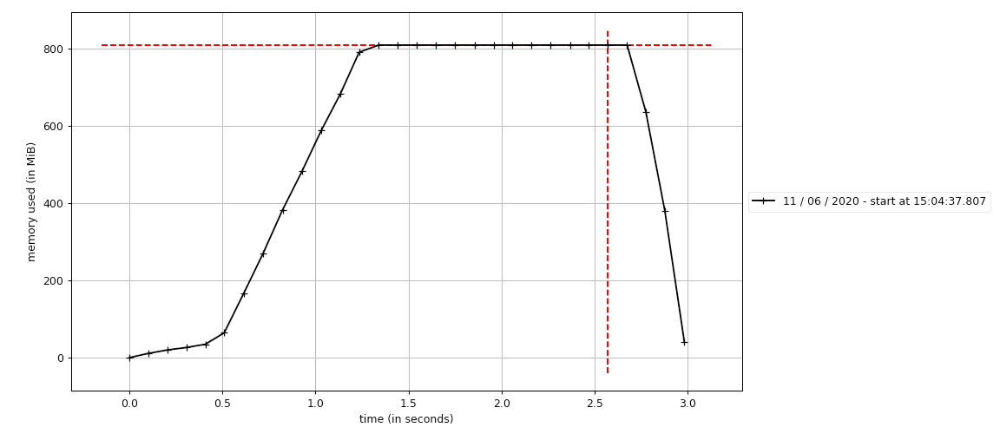

[](https://github.com/ariannasg/optimizing-python/actions?query=workflow%3A%22CI+Workflow%22)
[](LICENSE.md)

# Optimizing Python Code - Course

* [Description](#description)
* [Objectives](#objectives)
* [Local setup](#local-setup)
* [Security](#security)
* [Using IPython](#using-ipython)
* [Using cProfile](#using-cprofile)
* [Using pstats](#using-pstats)
* [Using SnakeViz](#using-snakeviz)
* [Using kernprof and line_profiler](#using-kernprof-and-line_profiler)
* [Using memory_profiler](#using-memory_profiler)
* [Using mprof and matplot](#using-mprof-and-matplot)
* [Using pytest-benchmark](#using-pytest-benchmark)
* [License](#license)

## Description
Understanding how to optimise Python by following the course https://www.linkedin.com/learning/faster-python-code/.

## Objectives
- Rules of optimization
- Measuring time
- Using line_profiler
- Picking the right data structure
- Using the bisect module
- Memory allocation in Python
- Caching, cheating, and parallel computing
- NumPy, Numba, and Cython
- Design and code reviews

## Local setup
- Install python 3: https://www.python.org/downloads/.
- Create and activate a virtual environment, then install project dependencies:
    ```
    python3 -m venv ~/.python-envs/optimizing-python
    source  ~/.python-envs/optimizing-python/bin/activate
    (optimizing-python) ➜  make install
    ```
- Configure the IDE Interpreter to use the virtual environment as project interpreter.
- Setup the run configuration in the IDE if needed: https://www.jetbrains.com/help/pycharm/creating-and-editing-run-debug-configurations.html?keymap=secondary_macos.

## Security
Command for running security checks on installed dependencies:
```
make security
```

## Using IPython
This is an example of trying out a timeit calculation using the IPython Notebook. 
To load the code we use the "run" magic method. 
The "-n" tells run not to run the main part of the code, just to load the functions in the file.
Here with use_catch we gain around 20% speed-up (167/206 = 0.8106796116504854).
```
(optimizing-python) ➜ ipython
Python 3.8.3 (v3.8.3:6f8c8320e9, May 13 2020, 16:29:34) 
Type 'copyright', 'credits' or 'license' for more information
IPython 7.15.0 -- An enhanced Interactive Python. Type '?' for help.

In [1]: %run -n src/using_timeit.py                                                                                                                                                                  

In [2]: %timeit use_get('a')                                                                                                                                                                         
206 ns ± 9.75 ns per loop (mean ± std. dev. of 7 runs, 1000000 loops each)

In [3]: %timeit use_catch('a')                                                                                                                                                                       
167 ns ± 5.37 ns per loop (mean ± std. dev. of 7 runs, 10000000 loops each)
```

This is an example of how to profile using `prun` in IPython. 
By default prun sorts the results by time.
To view what options we have we can do `%prun?`
```
(optimizing-python) ➜  optimizing-python git:(master) ✗ ipython
Python 3.8.3 (v3.8.3:6f8c8320e9, May 13 2020, 16:29:34) 
Type 'copyright', 'credits' or 'license' for more information
IPython 7.15.0 -- An enhanced Interactive Python. Type '?' for help.

In [1]: %run -n src/prof.py                                                                                                                                                                

In [2]: cases = list(gen_cases(1000)) 

In [3]: %prun bench_login(cases)  

         8936 function calls in 0.033 seconds

   Ordered by: internal time

   ncalls  tottime  percall  cumtime  percall filename:lineno(function)
     1000    0.017    0.000    0.017    0.000 {method 'execute' of 'sqlite3.Cursor' objects}
      983    0.005    0.000    0.005    0.000 {built-in method _crypt.crypt}
     1000    0.004    0.000    0.004    0.000 {method 'fetchone' of 'sqlite3.Cursor' objects}
     1000    0.002    0.000    0.024    0.000 login.py:12(user_passwd)
     1000    0.002    0.000    0.033    0.000 login.py:30(login)
     1000    0.001    0.000    0.001    0.000 {method 'cursor' of 'sqlite3.Connection' objects}
:
                                             
                                                                                                                
In [4]: %prun -s cumulative bench_login(cases)   

         8936 function calls in 0.031 seconds

   Ordered by: cumulative time

   ncalls  tottime  percall  cumtime  percall filename:lineno(function)
        1    0.000    0.000    0.031    0.031 {built-in method builtins.exec}
        1    0.000    0.000    0.031    0.031 <string>:1(<module>)
        1    0.001    0.001    0.031    0.031 prof.py:22(bench_login)
     1000    0.001    0.000    0.030    0.000 login.py:30(login)
     1000    0.002    0.000    0.022    0.000 login.py:12(user_passwd)
     1000    0.016    0.000    0.016    0.000 {method 'execute' of 'sqlite3.Cursor' objects}

```

This is an example of how to use the line_profiler in IPython.
In this case, we'll use line_profiler to get a more detail profiling of the 
login function in particular.
```
(optimizing-python) ➜ ipython
Python 3.8.3 (v3.8.3:6f8c8320e9, May 13 2020, 16:29:34) 
Type 'copyright', 'credits' or 'license' for more information
IPython 7.15.0 -- An enhanced Interactive Python. Type '?' for help.

In [1]: %run -n src/prof.py                                                                                                                                                                

In [2]: cases = list(gen_cases(1000))                                                                                                                                                                

In [3]: %load_ext line_profiler                                                                                                                                                                      

In [4]: %lprun -f login bench_login(cases)      
Timer unit: 1e-06 s

Total time: 0.03381 s
File: <...>/optimizing-python/src/login.py
Function: login at line 31

Line #      Hits         Time  Per Hit   % Time  Line Contents
==============================================================
    31                                           def login(user, passwd):
    32                                               """Return True is user/passwd pair matches"""
    33      1000        485.0      0.5      1.4      try:
    34      1000      25466.0     25.5     75.3          db_passwd = user_passwd(user)
    35        21         19.0      0.9      0.1      except KeyError:
    36        21         22.0      1.0      0.1          return False
    37                                           
    38       979       7271.0      7.4     21.5      passwd = encrypt_passwd(passwd)
    39       979        547.0      0.6      1.6      return passwd == db_passwd

```

This is an example of how to use the memory_profiler in IPython.
In this case, we'll use memory_profiler to understand the memory that is being 
allocated when using `__dict__` vs `__slot__` to store object attributes.
Checking the size of objects that use `__dict__` and `__slot__` won't make a 
difference because what we get is the size of the lists of pointers to the
objects, which is the same size in both cases. 
We need to use memory_profiler to understand how much memory the objects consume.
The important metric here is the mebibytes (MiB) which appears in "Increment".
We can see that with `__dict__` we get 8.5 MiB and with `__slots__` 2.9 MiB; 
this is almost 3 times less memory by adding just one line of code.
```
(optimizing-python) ➜ ipython
Python 3.8.3 (v3.8.3:6f8c8320e9, May 13 2020, 16:29:34) 
Type 'copyright', 'credits' or 'license' for more information
IPython 7.15.0 -- An enhanced Interactive Python. Type '?' for help.

In [1]: %run src/slots.py                                                                                                                                                                            

In [2]: import sys                                                                                                                                                                                   

In [3]: sys.getsizeof(points)                                                                                                                                                                        
Out[3]: 8697456

In [4]: sys.getsizeof(spoints)                                                                                                                                                                       
Out[4]: 8697456

In [5]: %load_ext memory_profiler                                                                                                                                                                    

In [6]: %mprun -f alloc_points alloc_points(n)                                                                                                                                                       
Filename: <...>/optimizing-python/src/slots.py

Line #    Mem usage    Increment   Line Contents
================================================
    32    314.4 MiB    314.4 MiB       def alloc_points(n):
    33    508.2 MiB      8.5 MiB           return [Point(i, i) for i in range(n)]


In [7]: %mprun -f alloc_spoints alloc_spoints(n)                                                                                                                                                     
Filename: <...>/optimizing-python/src/slots.py

Line #    Mem usage    Increment   Line Contents
================================================
    36    326.7 MiB    326.7 MiB       def alloc_spoints(n):
    37    379.5 MiB      2.9 MiB           return [SPoint(i, i) for i in range(n)]
```

## Using cProfile
- Using the command line to view all stats:
```
(optimizing-python) ➜ python -m cProfile src/prof.py
```
- Using the command line to output stats to a file:
```
(optimizing-python) ➜ python -m cProfile --outfile=src/prof.out src/prof.py
```
- Using the IDE: 
Run the profiler on `src/prof.py` as specified in https://www.jetbrains.com/help/pycharm/profiler.html

## Using pstats
The `src/prof.out` file was generated by `src.using_cprofile_file.py` where we
we run cProfile and use an output file to save all stats.
- Using the command line:
```
(optimizing-python) ➜ python -m pstats src/prof.out 
Welcome to the profile statistics browser.
src/prof.out% stats 3
Thu Jun 11 12:18:52 2020    src/prof.out

         23 function calls in 0.000 seconds

   Random listing order was used
   List reduced from 14 to 3 due to restriction <3>

   ncalls  tottime  percall  cumtime  percall filename:lineno(function)
        1    0.000    0.000    0.000    0.000 {built-in method builtins.exec}
        2    0.000    0.000    0.000    0.000 {built-in method builtins.isinstance}
        1    0.000    0.000    0.000    0.000 <...>/optimizing-python/src/using_cprofile_file.py:7(bench_targeted_login_with_file)


src/prof.out% sort ncalls
src/prof.out% stats 3
Thu Jun 11 12:18:52 2020    src/prof.out

         23 function calls in 0.000 seconds

   Ordered by: call count
   List reduced from 14 to 3 due to restriction <3>

   ncalls  tottime  percall  cumtime  percall filename:lineno(function)
        2    0.000    0.000    0.000    0.000 {built-in method builtins.isinstance}
        2    0.000    0.000    0.000    0.000 <...>/optimizing-python/src/login.py:30(login)
        2    0.000    0.000    0.000    0.000 <...>/optimizing-python/src/login.py:12(user_passwd)


src/prof.out% sort tottime
src/prof.out% stats 3
Thu Jun 11 12:10:40 2020    src/prof.out

         23 function calls in 0.007 seconds

   Ordered by: internal time
   List reduced from 14 to 3 due to restriction <3>

   ncalls  tottime  percall  cumtime  percall filename:lineno(function)
        2    0.007    0.004    0.007    0.004 {method 'execute' of 'sqlite3.Cursor' objects}
        1    0.000    0.000    0.007    0.007 {built-in method builtins.exec}
        2    0.000    0.000    0.007    0.004 <...>/optimizing-python/src/login.py:12(user_passwd)

```

## Using SnakeViz
For a much better graphic version of the pstats we can use SnakeViz:
```
(optimizing-python) ➜ snakeviz src/prof.out 
snakeviz web server started on 127.0.0.1:8080; enter Ctrl-C to exit
http://127.0.0.1:8080/snakeviz/<...>optimizing-python%2Fsrc%2Fprof.out
```



## Using kernprof and line_profiler
Be aware of the usage of the `@profile` that will throw error when just running the file.
It should be used just when running `kernprof`!
This is the command for getting the time profile of a function in a more detailed way:
```
(optimizing-python) ➜ kernprof -l src/using_line_and_memory_profiler.py 
999996
Wrote profile results to using_line_and_memory_profiler.py.lprof
(optimizing-python) ➜ python -m line_profiler using_line_and_memory_profiler.py.lprof 
Timer unit: 1e-06 s

Total time: 0.328005 s
File: src/using_line_and_memory_profiler.py
Function: sum_of_diffs at line 4

Line #      Hits         Time  Per Hit   % Time  Line Contents
==============================================================
     4                                           @profile
     5                                           def sum_of_diffs(vals):
     6                                               """Compute sum of diffs"""
     7         1       4270.0   4270.0      1.3      vals2 = vals[1:]
     8                                           
     9         1          3.0      3.0      0.0      total = 0
    10    333333     152049.0      0.5     46.4      for v1, v2 in zip(vals, vals2):
    11    333332     171683.0      0.5     52.3          total += v2 - v1
    12                                           
    13         1          0.0      0.0      0.0      return total
```

## Using memory_profiler
Be aware of the usage of the `@profile` that will throw error when just running the file.
It should be used just when running `memory_profiler`!
This is the command for getting the memory profile of a given function:
```
(optimizing-python) ➜ python -m memory_profiler src/using_line_and_memory_profiler.py
999996
Filename: src/using_memory_profiler.py

Line #    Mem usage    Increment   Line Contents
================================================
     4   50.293 MiB   50.293 MiB   @profile
     5                             def sum_of_diffs(vals):
     6                                 """Compute sum of diffs"""
     7   52.840 MiB    2.547 MiB       vals2 = vals[1:]
     8                             
     9   52.840 MiB    0.000 MiB       total = 0
    10   52.844 MiB    0.000 MiB       for v1, v2 in zip(vals, vals2):
    11   52.844 MiB    0.004 MiB           total += v2 - v1
    12                             
    13   52.844 MiB    0.000 MiB       return total
```

## Using mprof and matplot
In this example we'll use mprof to generate and see a graph of how our memory 
is likely to continue growing for a given function. 
We should measure loops over time with mprof and then plot the `.dat` generated files
to understand potential memory issues.

```
(optimizing-python) ➜ mprof run src/using_mprof.py 
mprof: Sampling memory every 0.1s
running as a Python program...
0
(optimizing-python) ➜ mprof plot mprofile_20200611150437.dat 
```


## Using pytest-benchmark
Using the command on a benchmark test that uses the benchmark fixture.
This test is on `test_fib.py`. We first run the fib function without cache and then
add the cache decorator to run pytest-benchmark again and see the comparison 
of the performance.
```
(optimizing-python) ➜ pytest --benchmark-autosave
======================================================================================== test session starts ========================================================================================
platform darwin -- Python 3.8.3, pytest-5.4.3, py-1.8.1, pluggy-0.13.1
benchmark: 3.2.3 (defaults: timer=time.perf_counter disable_gc=False min_rounds=5 min_time=0.000005 max_time=1.0 calibration_precision=10 warmup=False warmup_iterations=100000)
rootdir: <...>/optimizing-python
plugins: benchmark-3.2.3
collected 1 item                                                                                                                                                                                    

src/test_fib.py .                                                                                                                                                                             [100%]
Saved benchmark data in: <...>/optimizing-python/.benchmarks/Darwin-CPython-3.8-64bit/0001_aac4f82c7e0fc7bea055e84c1f37861581066d87_20200612_191208_uncommited-changes.json

----------------------------------------------- benchmark: 1 tests -----------------------------------------------
Name (time in ms)          Min       Max      Mean  StdDev    Median     IQR  Outliers     OPS  Rounds  Iterations
------------------------------------------------------------------------------------------------------------------
test_fib              359.9081  382.4121  373.4391  8.3471  375.3431  8.6162       2;0  2.6778       5           1
------------------------------------------------------------------------------------------------------------------

Legend:
  Outliers: 1 Standard Deviation from Mean; 1.5 IQR (InterQuartile Range) from 1st Quartile and 3rd Quartile.
  OPS: Operations Per Second, computed as 1 / Mean
========================================================================================= 1 passed in 5.12s =========================================================================================


(optimizing-python) ➜ pytest --benchmark-autosave --benchmark-compare
Comparing against benchmarks from: Darwin-CPython-3.8-64bit/0001_aac4f82c7e0fc7bea055e84c1f37861581066d87_20200612_191208_uncommited-changes.json
======================================================================================== test session starts ========================================================================================
platform darwin -- Python 3.8.3, pytest-5.4.3, py-1.8.1, pluggy-0.13.1
benchmark: 3.2.3 (defaults: timer=time.perf_counter disable_gc=False min_rounds=5 min_time=0.000005 max_time=1.0 calibration_precision=10 warmup=False warmup_iterations=100000)
rootdir: <...>/optimizing-python
plugins: benchmark-3.2.3
collected 1 item                                                                                                                                                                                    

src/test_fib.py .                                                                                                                                                                             [100%]
Saved benchmark data in: <...>/optimizing-python/.benchmarks/Darwin-CPython-3.8-64bit/0002_aac4f82c7e0fc7bea055e84c1f37861581066d87_20200612_191352_uncommited-changes.json

----------------------------------------------------------------------------------------------------------------- benchmark: 2 tests -----------------------------------------------------------------------------------------------------------------
Name (time in ns)                        Min                         Max                        Mean                    StdDev                      Median                       IQR            Outliers             OPS            Rounds  Iterations
------------------------------------------------------------------------------------------------------------------------------------------------------------------------------------------------------------------------------------------------------
test_fib (NOW)                      207.0000 (1.0)           29,545.0000 (1.0)              259.1928 (1.0)            261.7269 (1.0)              249.0000 (1.0)             50.0000 (1.0)        62;461  3,858,132.3430 (1.0)       28179           1
test_fib (0001_aac4f82)     359,908,106.0000 (>1000.0)  382,412,084.0000 (>1000.0)  373,439,087.2000 (>1000.0)  8,347,108.2545 (>1000.0)  375,343,131.0000 (>1000.0)  8,616,164.2500 (>1000.0)       2;0          2.6778 (0.00)          5           1
------------------------------------------------------------------------------------------------------------------------------------------------------------------------------------------------------------------------------------------------------

Legend:
  Outliers: 1 Standard Deviation from Mean; 1.5 IQR (InterQuartile Range) from 1st Quartile and 3rd Quartile.
  OPS: Operations Per Second, computed as 1 / Mean
========================================================================================= 1 passed in 2.61s =========================================================================================
```

## License
This project is licensed under the terms of the MIT License.
Please see [LICENSE](LICENSE.md) for details.